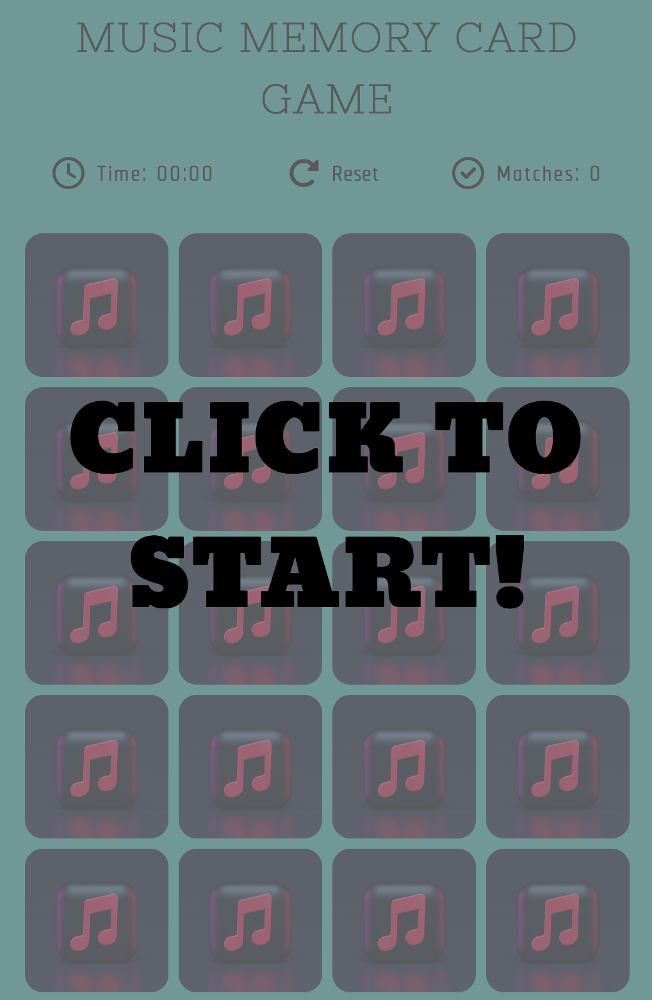
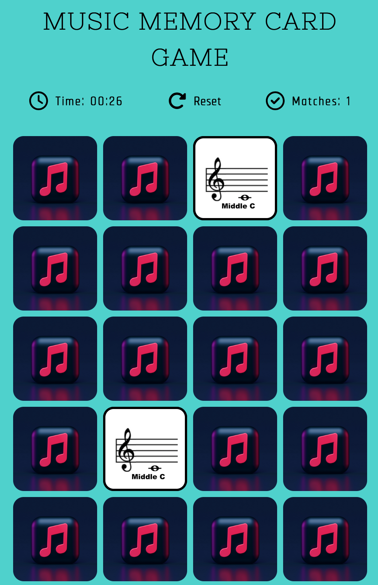

# Music Memory Card Game with JavaScript

## Table of Contents

- [Music Memory Card Game with JavaScript](#music-memory-card-game-with-javascript)
  - [Table of Contents](#table-of-contents)
  - [General Information](#general-information)
  - [Screenshots](#screenshots)
  - [Technologies](#technologies)
  - [Site Link](#site-link)
  - [What I Learned](#what-i-learned)
  - [Continued Learning](#continued-learning)
  - [Useful resources](#useful-resources)
  - [Credit](#credit)
  - [Author](#author)

---

## General Information

This is my version of a project idea from [40 JavaScript Projects for Beginners](https://www.freecodecamp.org/news/javascript-projects-for-beginners/), Project #21. The project listed in [freecodecamp](https://www.freecodecamp.org/) led you to a video coding along with Ania Kubow. I did not code along with Ania, but researched a variety of coding samples of a memory card games to develop how my card game would function. This card game has a timer that begins once you click on the opening screen. It checks for matching cards, that will remove pointer events and keep a two cards on screen if they are a match. There is a tally for each match found, and once all matches have been made it alerts the user that they have won, followed by a game reset. In addition, there is a reset button for the user to select should they want to beat their current time frame.

As a music educator, I chose to use images that I teach my students for this memory card game. Focusing on the treble clef lines and spaces and including middle c - which is a challenge for students when first learning these absolute note names.

## Screenshots

## Technologies

- HTML
- CSS
- JavaScript

## Site Link

>**Live Site: [Music Memory Game](https://vlorozco.github.io/javascript-music-memory-game/)**

## What I Learned

This project was challenging for me and I found the [Awesome Vanilla JavaScript Memory Card Game Tutorial with developedbyed](https://www.youtube.com/watch?v=-tlb4tv4mC4&t=2265s) to be very helpful in developing this game. The tutorial helped me in creating the card generator and breaking down the function to use `createElement` method for each card displayed on the grid, as well as the logic for each card. I learned about `pointerEvents` and utilizing them in both javascript and css.

## Continued Learning

I look forward to creating more JavaScript projects and strengthening my skills. Happy coding everyone!

## Useful resources

- [Simplest CSS reset to prevent headaches by Kevin Powell](https://www.youtube.com/watch?v=2lyDv0wOQuQ)
- [mdn web docs | Using CSS custom properties(variables)](https://developer.mozilla.org/en-US/docs/Web/CSS/Using_CSS_custom_properties)
- [CSS Variables - An introduction to CSS custom properties by Kevin Powell](https://www.youtube.com/watch?v=PHO6TBq_auI&t=4s)
- [GRID: a simple visual cheatsheet by Malven Co.](https://grid.malven.co/)
- [Awesome Vanilla JavaScript Memory Card Game Tutorial with developedbyed](https://www.youtube.com/watch?v=-tlb4tv4mC4&t=2265s)
- [JavaScript | MDN](https://developer.mozilla.org/en-US/docs/Web/JavaScript)
- [mdn web docs | transform-style](https://developer.mozilla.org/en-US/docs/Web/CSS/transform-style)

## Credit

- [Upsplash | Apple Music 3D Icon Concept by Alexander Shatov](https://unsplash.com/@alexbemore?utm_source=unsplash&utm_medium=referral&utm_content=creditCopyText)

## Author

- Github - [Veronica L. Orozco](https://github.com/VLOrozco)
- Frontend Mentor - [@VLOrozco](https://www.frontendmentor.io/profile/VLOrozco)
- Codecademy - [orozcov3](https://www.codecademy.com/profiles/orozcoV3)
